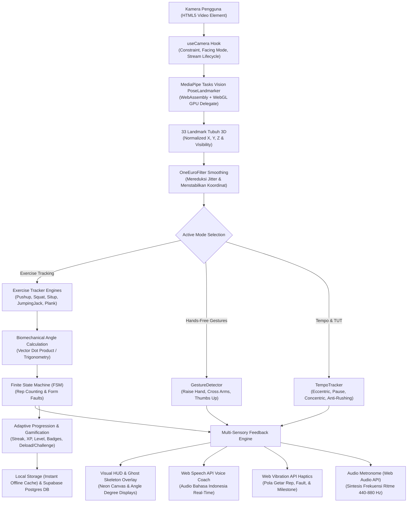

# SMART-FIT v2 — Smart Motion Analysis & Recognition Tracker for Intelligent Training

[-black?style=for-the-badge&logo=next.js)](https://nextjs.org/)
[](https://react.dev/)
[](https://www.typescriptlang.org/)
[-orange?style=for-the-badge&logo=google)](https://developers.google.com/mediapipe)
[](https://tailwindcss.com/)
[](https://vitest.dev/)
[](https://eslint.org/)
[](https://web.dev/progressive-web-apps/)

**SMART-FIT v2** adalah platform kebugaran cerdas berbasis peramban (*web-native*) yang memanfaatkan Computer Vision mutakhir (Google MediaPipe BlazePose) untuk menganalisis postur tubuh, menghitung repetisi latihan beban tubuh (*calisthenics*), mendeteksi kesalahan postur tubuh (*biomechanical fault detection*), dan memberikan bimbingan suara serta taktil secara *real-time*.

Aplikasi ini beroperasi **100% di sisi klien (*client-side edge computing*)** melalui WebAssembly (WASM) dan WebGL GPU acceleration. **Nol byte video dikirim ke server**, menjamin privasi pengguna secara mutlak tanpa beban biaya infrastruktur pemrosesan video cloud (*Zero Cloud Video Cost*).

---

## Daftar Isi
1. [Latar Belakang & Filosofi Desain](#1-latar-belakang--filosofi-desain)
2. [Arsitektur Sistem & Alur Data](#2-arsitektur-sistem--alur-data)
3. [Mesin Biomekanika & Deteksi Gerakan (5 Latihan Utama)](#3-mesin-biomekanika--deteksi-gerakan)
4. [6 Fitur Mutakhir Real-Time](#4-6-fitur-mutakhir-real-time)
5. [Mesin Progresi Adaptif & Gamifikasi](#5-mesin-progresi-adaptif--gamifikasi)
6. [Struktur Direktori Proyek](#6-struktur-direktori-proyek)
7. [Spesifikasi Teknologi (Tech Stack)](#7-spesifikasi-teknologi-tech-stack)
8. [Panduan Instalasi & Pengoperasian Lokal](#8-panduan-instalasi--pengoperasian-lokal)
9. [Variabel Lingkungan (.env.local)](#9-variabel-lingkungan-envlocal)
10. [Pengujian Otomatis & Standar Kualitas](#10-pengujian-otomatis--standar-kualitas)
11. [Keamanan, Privasi, & Dukungan PWA](#11-keamanan-privasi--dukungan-pwa)

---

## 1. Latar Belakang & Filosofi Desain

### Evolusi dari v1 ke v2
*   **SMART-FIT v1 (Warisan):** Menggunakan Python, OpenCV, YOLOv8 Pose di desktop dengan mikrokontroler ESP32-CAM dan transmisi data ke platform IoT Ubidots. Memerlukan perangkat keras khusus, instalasi runtime Python lokal, dan latensi jaringan.
*   **SMART-FIT v2 (Modern):** Ditulis ulang secara penuh menggunakan ekosistem web modern (Next.js 16 App Router + React 19 + TypeScript). Cukup buka peramban di laptop, tablet, atau smartphone tanpa perlu instalasi aplikasi toko native atau perangkat keras eksternal tambahan.

### Prinsip Utama
1.  **Zero-Video-Egress Privacy:** Bingkai video dari kamera diproses murni di memori RAM dan GPU perangkat pengguna menggunakan WebAssembly dan WebGL shader. Sesuai prinsip *Privacy by Design*, GDPR, dan UU Pelindungan Data Pribadi (UU PDP).
2.  **Ultra-Low Latency (<20ms):** Inferensi MediaPipe berjalan pada 30–60 FPS langsung di thread peramban dengan filtering adaptif, memberikan umpan balik suara seketika saat form salah terjadi.
3.  **Cross-Platform PWA:** Dapat diinstal langsung ke layar utama ponsel (Home Screen) sebagai Progressive Web App dengan dukungan luring (*offline-first*).

---

## 2. Arsitektur Sistem & Alur Data

Alur data dari kamera hingga umpan balik multi-sensori digambarkan dalam diagram alir berikut:



---

## 3. Mesin Biomekanika & Deteksi Gerakan

Sistem menggunakan 33 titik anatomis standar BlazePose:

```
                  0 [Hidung]
             1 [Mata Kiri Dlm]   4 [Mata Kanan Dlm]
             2 [Mata Kiri]       5 [Mata Kanan]
             3 [Mata Kiri Luar]  6 [Mata Kanan Luar]
                   7 [Telinga Kiri]    8 [Telinga Kanan]
                     9 [Mulut Kiri]    10 [Mulut Kanan]
         11 [Bahu Kiri] ------------------ 12 [Bahu Kanan]
              |                                  |
         13 [Siku Kiri]                     14 [Siku Kanan]
              |                                  |
     15 [Pergelangan Kiri]              16 [Pergelangan Kanan]
              |                                  |
        23 [Panggul Kiri] ---------------- 24 [Panggul Kanan]
              |                                  |
         25 [Lutut Kiri]                    26 [Lutut Kanan]
              |                                  |
    27 [Pergelangan Kaki Kiri]         28 [Pergelangan Kaki Kanan]
```

### Formula Dasar Perhitungan Sudut 3D
Sudut sendi $\theta$ dibentuk oleh tiga titik koordinat $A$ (proksimal), $B$ (sendi/vertex), dan $C$ (distal):

$$\vec{u} = \vec{A} - \vec{B} = (x_A - x_B, y_A - y_B)$$
$$\vec{v} = \vec{C} - \vec{B} = (x_C - x_B, y_C - y_B)$$
$$\cos \theta = \frac{\vec{u} \cdot \vec{v}}{\|\vec{u}\| \|\vec{v}\|} = \frac{u_x v_x + u_y v_y}{\sqrt{u_x^2 + u_y^2} \sqrt{v_x^2 + v_y^2}}$$
$$\theta = \arccos(\text{clamp}(\cos \theta, -1.0, 1.0)) \times \left(\frac{180^\circ}{\pi}\right)$$

### 1. Push-up Engine (`src/trackers/pushup.ts`)
*   **Kamera:** Samping (*Side View*).
*   **Sendi Kunci:** Bahu (`11`/`12`), Siku (`13`/`14`), Pergelangan Tangan (`15`/`16`), Panggul (`23`/`24`), Pergelangan Kaki (`27`/`28`).
*   **Logika Finite State Machine (FSM):**
    *   **Posisi Atas (Start/Peak):** Sudut siku $> 160^\circ$.
    *   **Posisi Bawah (Depth):** Sudut siku $\le 90^\circ$ (dengan toleransi dinamis berdasarkan jarak tubuh).
    *   **Repetisi Sah:** Transisi `up -> down -> up` dengan form valid.
*   **Deteksi Kesalahan Postur (Faults):**
    *   `sagging_hips`: Sudut Garis Tubuh (Bahu-Panggul-Kaki) $< 155^\circ$ (Pinggul merosot ke lantai).
    *   `piked_hips`: Sudut Garis Tubuh $> 195^\circ$ (Pantat terlalu menungging ke atas).
    *   `shallow_rep`: Sudut siku tidak mencapai kedalaman $< 100^\circ$ saat kembali naik.

### 2. Bodyweight Squat Engine (`src/trackers/squat.ts`)
*   **Kamera:** Samping atau Diagonal ($45^\circ$).
*   **Sendi Kunci:** Panggul (`23`/`24`), Lutut (`25`/`26`), Pergelangan Kaki (`27`/`28`), Bahu (`11`/`12`).
*   **Logika FSM:**
    *   **Posisi Berdiri:** Sudut lutut $> 165^\circ$.
    *   **Posisi Bawah (Parallel Squat):** Sudut lutut $\le 95^\circ$.
*   **Deteksi Kesalahan Postur (Faults):**
    *   `knee_over_toes`: Proyeksi horizontal lutut melampaui ujung jari kaki secara berlebihan ($> 12\%$ panjang tibia).
    *   `excessive_forward_lean`: Kemiringan garis torso terhadap garis vertikal $> 45^\circ$.
    *   `shallow_squat`: Berhenti sebelum paha sejajar lantai ($> 105^\circ$).

### 3. Sit-up Engine (`src/trackers/situp.ts`)
*   **Kamera:** Samping (*Side View*).
*   **Sendi Kunci:** Bahu (`11`/`12`), Panggul (`23`/`24`), Lutut (`25`/`26`).
*   **Logika FSM:**
    *   **Posisi Bawah (Berbaring):** Sudut torso-panggul-lutut $> 135^\circ$.
    *   **Posisi Atas (Duduk Penuh):** Sudut panggul $\le 60^\circ$.
*   **Deteksi Kesalahan Postur (Faults):**
    *   `incomplete_range`: Torso tidak terangkat penuh ke atas ($> 70^\circ$).
    *   `feet_lifting`: Jarak pergelangan kaki dari lantai terangkat lebih dari batas ambang.

### 4. Jumping Jack Engine (`src/trackers/jumping-jack.ts`)
*   **Kamera:** Depan (*Front View*).
*   **Sendi Kunci:** Bahu (`11`/`12`), Pergelangan Tangan (`15`/`16`), Panggul (`23`/`24`), Pergelangan Kaki (`27`/`28`).
*   **Logika FSM:**
    *   **Fase Tertutup:** Lengan di samping paha (sudut abduksi bahu $< 40^\circ$), kedua kaki rapat (jarak kaki $< 0.8\times$ lebar bahu).
    *   **Fase Terbuka:** Kedua tangan di atas kepala ($> 145^\circ$), kedua kaki terbuka lebar ($> 1.4\times$ lebar bahu).
*   **Deteksi Kesalahan Postur (Faults):**
    *   `arms_not_high`: Lengan tidak diangkat melewati garis bahu.
    *   `feet_not_wide`: Kaki tidak melompat cukup lebar.

### 5. Isometric Plank Engine (`src/trackers/plank.ts`)
*   **Kamera:** Samping (*Side View*).
*   **Sendi Kunci:** Bahu (`11`/`12`), Siku/Tangan, Panggul (`23`/`24`), Pergelangan Kaki (`27`/`28`).
*   **Logika Pengukur Waktu Tahan (Hold Timer):**
    *   Sistem menghitung akumulasi detik selama garis tubuh lurus memenuhi rentang toleransi $160^\circ - 180^\circ$.
    *   Penghitung detik otomatis berhenti (*paused*) jika form rusak, dan lanjut saat form diperbaiki.
*   **Deteksi Kesalahan Postur (Faults):**
    *   `sagging_hips`: Pinggul jatuh ke lantai (sudut bahu-panggul-kaki $< 155^\circ$).
    *   `raised_butt`: Panggul terangkat terlalu tinggi ($> 195^\circ$).

---

## 4. 6 Fitur Mutakhir Real-Time

SMART-FIT v2 dilengkapi dengan 6 kapabilitas mutakhir yang dirancang khusus untuk kenyamanan latihan jarak jauh:

### 1. Hands-Free Gesture Control (Navigasi Nirsentuh Jarak Jauh)
*   **Modul:** `src/lib/gestures/detector.ts`
*   **Tujuan:** Memungkinkan pengguna mengoperasikan latihan dari jarak 2–3 meter tanpa menyentuh layar gawai berkeringat.
*   **Gestur yang Didukung:**
    1.  **Angkat Tangan (*Raise Hand*):** Mengangkat salah satu pergelangan tangan di atas mata selama 1.4 detik $\rightarrow$ Memicu **Jeda / Lanjut Latihan** (`toggle_pause`).
    2.  **Silang Lengan di Dada (*Cross Arms*):** Menyilangkan kedua pergelangan tangan di depan dada selama 1.8 detik $\rightarrow$ Memicu **Selesai Latihan** (`finish_workout`).
    3.  **Jempol ke Atas (*Thumbs Up*):** Konfirmasi kesiapan latihan.
*   **Pencegahan Salah Picu (*False-Trigger Immunity*):** Dilengkapi cooldown lockout 2.5 detik pasca-eksekusi, serta animasi lingkaran progres neon (*radial progress ring*) pada kanvas kamera.

### 2. Real-Time Tempo & Time Under Tension (TUT) Tracker
*   **Modul:** `src/lib/tempo/tempo-tracker.ts`
*   **Metrik Standar Internasional:** Format rasio tempo `[Eksentrik]-[Jeda Bawah]-[Konsentrik]` (Contoh: `3-1-1`, total TUT = 5 detik per repetisi).
*   **Deteksi Anti-Terburu-buru (*Anti-Rushing Coach*):**
    *   Fase turun terkontrol membutuhkan durasi minimal $\ge 0.8$ detik.
    *   Jika fase turun $< 0.7$ detik, sistem menampilkan label peringatan *"⚠️ Terburu-buru"* di HUD dan suara coach memberi instruksi perbaikan: *"Kendalikan tempo, turun lebih perlahan!"*.

### 3. Sensory Coaching (Web Vibration Haptics & Audio Cadence Metronome)
*   **Modul:** `src/lib/audio/haptics.ts` & `src/lib/audio/metronome.ts`
*   **Web Vibration API:**
    *   Repetisi Sah: `60ms` getaran ringan.
    *   Kesalahan Form: `[100ms, 60ms, 100ms]` getaran ganda tegas.
    *   Target Selesai: `[100ms, 50ms, 100ms, 50ms, 200ms]` getaran ritmis kemenangan.
*   **Audio Cadence Metronome (Web Audio API Synthesizer):**
    *   Membangkitkan sinyal osilator sinusoidal murni (tanpa file mp3/wav eksternal):
        *   Fase Desentralisasi: `440 Hz` (Nada rendah penuntun ritme).
        *   Titik Bawah: `550 Hz` (Nada penanda titik balik kontraksi).
        *   Fase Dorongan: `880 Hz` (Nada tinggi pemicu daya eksplosif).

### 4. Custom Routine / Circuit Builder
*   **Modul:** `src/lib/routines/presets.ts` & `src/components/workout/CustomRoutineBuilder.tsx`
*   **Kapabilitas:**
    *   Pengguna dapat meracik program sirkuit sendiri dengan memilih kombinasi gerakan dari 5 latihan yang ada.
    *   Setiap langkah dapat dikonfigurasi target repetisi atau durasi detik, serta durasi istirahat antarlatihan (*rest interval*).
    *   Tersedia transisi otomatis layar istirahat (*Rest Timer* interaktif) dengan visual progres bar, audio hitung mundur, dan tombol lewati (*Skip*).
    *   Tersimpan aman di penyimpanan lokal peramban (`localStorage`).

### 5. Ghost Skeleton Live Overlay (Bayangan Form Ideal Real-Time)
*   **Modul:** `src/lib/mediapipe/drawing-utils.ts` & `src/lib/mediapipe/reference-poses.ts`
*   **Mekanisme Visual:**
    *   Memproyeksikan siluet kerangka neon transparan (*ethereal ghost skeleton*) di atas video pengguna secara langsung.
    *   **Dynamic Bounding Box Alignment:** Algoritma secara adaptif menyesuaikan skala tinggi tubuh, lebar bahu, dan posisi tengah pengguna agar siluet rujukan pas membayangi tubuh pengguna.
    *   **Sine Wave Interpolation:** Bergerak naik-turun secara mulus sesuai ritme ideal 3.2 detik sebagai panduan visual postur dan tempo.
    *   Dapat diaktifkan/dinonaktifkan langsung lewat tombol HUD *"👻 Bayangan Form"*.

### 6. Adaptive Frame Throttling & Hardware Smoothing
*   **Modul:** `src/hooks/usePoseDetection.ts`
*   **Optimalisasi Performa:**
    *   Memonitor framerate perangkat secara berkala.
    *   Jika framerate gawai turun di bawah $22\text{ FPS}$ (pada gawai hemat daya atau smartphone murah), inferensi MediaPipe dialihkan ke mode selang-seling (1 kali per 2 frame).
    *   Frame antara diinterpolasi menggunakan filter OneEuroFilter, memastikan antarmuka kanvas tetap terender halus pada $60\text{ FPS}$ tanpa kelebihan beban CPU/GPU.

### 7. Deteksi Asimetri Bilateral Kiri vs Kanan (Bilateral Muscle Imbalance Detection)
*   **Modul:** `src/lib/biomechanics/asymmetry.ts`
*   **Komponen UI:** `src/components/workout/SymmetryIndicator.tsx`
*   **Tujuan:** Mencegah cedera sendi akibat kompensasi beban berlebih pada salah satu sisi tubuh (*unilateral compensation*).
*   **Mekanisme:**
    *   Menganalisis pasangan sendi secara simultan per frame:
        *   **Squat:** Fleksi lutut kiri (`23-25-27`) vs lutut kanan (`24-26-28`). Ambang batas toleransi $12^\circ$.
        *   **Push-up & Plank:** Fleksi siku kiri (`11-13-15`) vs siku kanan (`12-14-16`). Ambang batas toleransi $14^\circ$.
        *   **Jumping Jack:** Rentang abduksi lengan kiri vs kanan. Ambang batas toleransi $15^\circ$.
    *   Menghasilkan Skor Keseimbangan Bilateral (0–100%) dan visualisasi balance bar interaktif `[ L ◄◄──|──►► R ]` di HUD.
    *   Akumulator sesi menghitung rata-rata simetri keseluruhan untuk laporan evaluasi akhir dan audit PDF.

### 8. Kontrol Suara Dua Arah (Two-Way Voice Commands Bahasa Indonesia)
*   **Modul:** `src/lib/audio/voice-commands.ts`
*   **Tujuan:** Memberikan kemudahan kontrol latihan tanpa sentuh saat posisi tubuh bertumpu di lantai (misal saat push-up atau plank).
*   **Mekanisme:**
    *   Mengintegrasikan Web Speech Recognition API (`id-ID`) dengan parser NLP toleran sinonim:
        *   `"mulai"` / `"start"` / `"gas"` $\rightarrow$ Memulai hitung mundur / inferensi aktif.
        *   `"jeda"` / `"pause"` / `"tunggu"` / `"stop"` $\rightarrow$ Menjeda latihan.
        *   `"lanjut"` / `"resume"` / `"teruskan"` $\rightarrow$ Melanjutkan latihan.
        *   `"selesai"` / `"finish"` / `"kelar"` $\rightarrow$ Menyelesaikan sesi latihan.
        *   `"ulang"` / `"reset"` $\rightarrow$ Mengulang sesi dari awal.
    *   Dilengkapi cooldown lockout 2.0 detik anti-pemicu berulang, getaran haptic konfirmasi, dan banner HUD real-time.

### 9. Ekspor Laporan Biomekanika PDF di Sisi Klien (Downloadable PDF Audit Report)
*   **Modul:** `src/lib/reporting/pdf-generator.ts` (didukung `jspdf`)
*   **Tujuan:** Menghasilkan dokumen laporan audit fisik formal yang dapat diunduh pengguna untuk arsip pribadi atau konsultasi dengan fisioterapis/pelatih.
*   **Isi Laporan A4 Resmi:**
    1.  **Header Resmi:** Identitas sesi, tanggal & jam latihan, ID laporan unik.
    2.  **Grid Metrik Kunci:** Total Repetisi, Clean Reps, Durasi Sesi, Estimasi Kalori.
    3.  **Indeks Kualitas Form & Simetri:** Form Score (0–100), Bilateral Symmetry Score (0–100%), dan Tempo Ratio (3-1-1 / TUT).
    4.  **Tabel Audit Kesalahan Postur:** Nama kesalahan, frekuensi kejadian, dan rekomendasi koreksi fisioterapi.
    5.  **Rencana Tindak Lanjut (*AI Coach Action Plan*):** Rekomendasi target repetisi dan fokus adaptif sesi berikutnya.
    6.  **Tanda Tangan Digital Verifikasi Klien (100% Privacy Preserved).**

---

## 5. Mesin Progresi Adaptif & Gamifikasi

Sistem dirancang untuk menjaga retensi dan kenyamanan latihan jangka panjang:

### Adaptive Progression Engine (`src/lib/progression/engine.ts`)
*   Menganalisis 3 sesi latihan terakhir pengguna untuk setiap gerakan.
*   **Target Suggestion Algorithm:**
    *   *Challenge Target (+10% s.d. +20%):* Jika tingkat penyelesaian target $> 95\%$ dengan rata-rata Form Score $\ge 85\%$.
    *   *Maintain Target:* Jika latihan berada di batas kenyamanan performa.
    *   *Deload Target (-10% s.d. -20%):* Jika form score $< 70\%$ atau target repetisi gagal tercapai, sistem menurunkan beban latihan untuk mencegah cedera dan memperbaiki postur.

### Sistem Gamifikasi & Retensi (`src/lib/gamification/`)
*   **Streak Tracker:** Menghitung rutinitas hari berturut-turut dengan status *Active*, *At Risk*, atau *Broken*.
*   **Sistem Tingkatan (Levels):**
    *   Level 1: Pemula (0 - 499 XP)
    *   Level 2: Antusias (500 - 1,499 XP)
    *   Level 3: Atlet (1,500 - 3,499 XP)
    *   Level 4: Master (3,500 - 6,999 XP)
    *   Level 5: Legenda (7,000+ XP)
*   **10 Lencana Pencapaian (Achievements):**
    *   `first-rep`: Menyelesaikan repetisi pertama.
    *   `perfect-form`: Menyelesaikan sesi dengan Form Score $\ge 95\%$.
    *   `pushup-master`: Akumulasi 100 repetisi push-up.
    *   `squat-king`: Akumulasi 100 repetisi squat.
    *   `iron-core`: Akumulasi 5 menit plank.
    *   `streak-3`, `streak-7`, `streak-30`: Mempertahankan streak konsistensi latihan.
    *   `circuit-champ`: Menuntaskan program sirkuit multigerakan.
    *   `tempo-master`: Melakukan repetisi dengan kontrol tempo sempurna.

---

## 6. Struktur Direktori Proyek

```
smartfit-v2/
├── public/                     # Aset statis peramban & PWA
│   ├── favicon.ico
│   ├── manifest.json           # Web App Manifest PWA
│   ├── sw.js                   # Service Worker (Offline Caching)
│   └── models/                 # Model MediaPipe BlazePose TFLite
│       └── pose_landmarker_full.task
│
├── src/
│   ├── app/                    # Next.js App Router Pages & API Routes
│   │   ├── layout.tsx          # Root layout (Inter font, PWA meta, Audio init)
│   │   ├── page.tsx            # Landing page (Hero, Quick Start, Features)
│   │   ├── error.tsx           # Global Error Boundary
│   │   ├── workout/
│   │   │   ├── page.tsx        # Katalog Latihan Satuan & Sirkuit Rutin
│   │   │   ├── [exercise]/     # Halaman Latihan Satuan (Kamera & HUD)
│   │   │   └── routine/[routineId]/ # Halaman Pelari Program Sirkuit
│   │   ├── history/            # Dashboard Riwayat, Progresi, & Statistik
│   │   └── api/
│   │       ├── sessions/       # API CRUD Riwayat Sesi (Supabase Sync)
│   │       └── payment/        # API Midtrans Payment Gateway (Snap & Webhook)
│   │
│   ├── components/             # Komponen Antarmuka Reusable
│   │   ├── camera/
│   │   │   ├── CameraFeed.tsx               # Render video & overlay canvas
│   │   │   ├── CameraSetupGuide.tsx         # Panduan posisi kamera per latihan
│   │   │   ├── EnvironmentCheck.tsx         # Validasi pencahayaan & jarak tubuh
│   │   │   └── ReferencePoseVisualizer.tsx  # Panduan skeletal pose ideal
│   │   ├── workout/
│   │   │   ├── WorkoutHUD.tsx               # Heads-Up Display metrik langsung
│   │   │   ├── CountdownOverlay.tsx         # Hitung mundur 3-2-1 persiapan
│   │   │   ├── RestTimer.tsx                # Timer istirahat antarlatihan sirkuit
│   │   │   ├── CircuitProgress.tsx          # Status progres tahapan sirkuit
│   │   │   ├── CustomRoutineBuilder.tsx     # Modal peracik sirkuit kustom
│   │   │   └── SessionSummary.tsx           # Laporan evaluasi akhir sesi latihan
│   │   └── ui/
│   │       └── AchievementToast.tsx         # Notifikasi toast pencapaian lencana
│   │
│   ├── hooks/                  # Custom React Hooks
│   │   ├── useCamera.ts        # Manajemen MediaStream, resolusi, facing mode
│   │   └── usePoseDetection.ts # Loop inferensi MediaPipe, RAF, FPS, Ghost Skeleton
│   │
│   ├── lib/                    # Modul Utilitas, Engine & Integrasi
│   │   ├── audio/
│   │   │   ├── voice-coach.ts  # Web Speech API TTS Bahasa Indonesia
│   │   │   ├── haptics.ts      # Web Vibration API tactile patterns
│   │   │   └── metronome.ts    # Web Audio API synthetic cadence metronome
│   │   ├── gestures/
│   │   │   ├── detector.ts     # Hands-free gesture detector (Raise, Cross, Thumbs)
│   │   │   └── __tests__/      # Unit test detector gestur
│   │   ├── tempo/
│   │   │   ├── tempo-tracker.ts# Pelacak fase eksentrik, konsentrik & TUT
│   │   │   └── __tests__/      # Unit test tempo tracker
│   │   ├── progression/
│   │   │   ├── engine.ts       # Engine target repetisi adaptif & deload
│   │   │   └── __tests__/      # Unit test progresi adaptif
│   │   ├── gamification/
│   │   │   ├── streak.ts       # Kalkulasi streak harian & XP
│   │   │   ├── types.ts        # Definisi antarmuka lencana & level
│   │   │   └── __tests__/      # Unit test gamifikasi
│   │   ├── routines/
│   │   │   └── presets.ts      # Program sirkuit bawaan & penyimpanan kustom
│   │   ├── sharing/
│   │   │   ├── generator.ts    # Web Share API & generator kartu gambar kanvas
│   │   │   └── __tests__/      # Unit test generator gambar berbagi
│   │   ├── mediapipe/
│   │   │   ├── landmarker.ts   # Inisialisasi PoseLandmarker WebAssembly
│   │   │   ├── drawing-utils.ts# Render skeletal, sudut sendi, ghost overlay
│   │   │   └── reference-poses.ts # Basis data koordinat pose standar ideal
│   │   ├── supabase/
│   │   │   ├── client.ts       # Supabase browser client
│   │   │   └── server.ts       # Supabase server client
│   │   └── payment/
│   │       └── midtrans.ts     # Midtrans Snap API integration
│   │
│   └── trackers/               # Mesin Inferensi Biomekanika 5 Latihan
│       ├── base-tracker.ts     # Kelas abstrak antarmuka tracker latihan
│       ├── pushup.ts           # Tracker push-up
│       ├── squat.ts            # Tracker squat
│       ├── situp.ts            # Tracker sit-up
│       ├── jumping-jack.ts     # Tracker jumping jack
│       ├── plank.ts            # Tracker plank isometrik
│       ├── index.ts            # Factory & registri tracker
│       └── __tests__/          # Unit test komprehensif tracker latihan
│
├── supabase/
│   └── migrations/             # Migrasi skema database PostgreSQL
├── next.config.ts              # Konfigurasi Next.js (WASM, Headers, PWA)
├── vitest.config.ts            # Konfigurasi Vitest Test Runner
└── package.json                # Dependensi & script proyek
```

---

## 7. Spesifikasi Teknologi (Tech Stack)

| Kategori | Teknologi / Pustaka | Versi | Peran & Alasan Penggunaan |
| :--- | :--- | :--- | :--- |
| **Framework** | Next.js (App Router) | `16.3.5` | React framework dengan Turbopack untuk kompilasi ultra-cepat. |
| **UI Library** | React | `19.0.0` | React 19 dengan compiler optimasi ref & hook mutakhir. |
| **Bahasa** | TypeScript | `^5.0.0` | Strict type-safety untuk integritas koordinat geometris 3D. |
| **AI / Pose Vision** | `@mediapipe/tasks-vision` | `^0.10.18` | Model BlazePose WebAssembly/WebGL inference 100% lokal di peramban. |
| **Styling** | Tailwind CSS | `^4.0.0` | Dark neon UI utility classes responsif untuk mobile dan desktop. |
| **Ikon** | Lucide React | `^1.16.0` | Set ikon modern dan ringan. |
| **Database & Auth** | Supabase (PostgreSQL) | `@supabase/ssr` | Sinkronisasi riwayat latihan multi-perangkat (opsional / graceful fallback). |
| **Payment Gateway** | Midtrans (Snap API) | `midtrans-client` | Pembayaran langganan premium lokal Indonesia (GoPay, QRIS, VA Bank). |
| **Audio Engine** | Web Speech & Web Audio API | Native Browser | Pelatih suara otomatis & metronom sintetis tanpa beban dependensi eksternal. |
| **Pengujian** | Vitest | `^5.0.1` | Unit test runner secepat kilat yang kompatibel dengan ekosistem ESM. |

---

## 8. Panduan Instalasi & Pengoperasian Lokal

### Prasyarat
*   **Node.js:** Versi `18.18.0` atau yang lebih baru.
*   **Peramban Web:** Google Chrome, Microsoft Edge, Brave, Safari, atau Firefox versi modern yang mendukung WebAssembly dan WebGL.
*   **Webcam / Kamera HP:** Diperlukan untuk feed deteksi pose.

### Langkah Instalasi
1.  **Clone repositori:**
    ```bash
    git clone https://github.com/FaizIqbal123/SIC6-Project-master.git
    cd SIC6-Project-master/smartfit-v2
    ```

2.  **Instalasi dependensi:**
    ```bash
    npm install
    ```

3.  **Siapkan file environment:**
    Salin template konfigurasi:
    ```bash
    cp .env.example .env.local
    ```
    *(Jika Anda hanya ingin menjalankan pengujian lokal atau demonstrasi, konfigurasi Supabase dan Midtrans bersifat opsional karena sistem memiliki penyimpanan lokal bawaan `localStorage`)*.

4.  **Jalankan server pengembangan (Development Server):**
    ```bash
    npm run dev
    ```
    Buka alamat `http://localhost:3000` pada peramban Anda.

5.  **Build untuk lingkungan produksi:**
    ```bash
    npm run build
    npm run start
    ```

---

## 9. Variabel Lingkungan (.env.local)

Buat file `.env.local` pada direktori `smartfit-v2/` jika ingin mengaktifkan fitur sinkronisasi cloud dan pembayaran Midtrans:

```env
# URL Domain Aplikasi
NEXT_PUBLIC_APP_URL=http://localhost:3000

# Konfigurasi Supabase (Opsional - Jika kosong, aplikasi menggunakan LocalStorage)
NEXT_PUBLIC_SUPABASE_URL=https://your-project.supabase.co
NEXT_PUBLIC_SUPABASE_ANON_KEY=your-anon-key
SUPABASE_SERVICE_ROLE_KEY=your-service-role-key

# Konfigurasi Midtrans Payment Gateway (Opsional)
MIDTRANS_SERVER_KEY=SB-Mid-server-xxxxxxxxxxxx
NEXT_PUBLIC_MIDTRANS_CLIENT_KEY=SB-Mid-client-xxxxxxxxxxxx
MIDTRANS_IS_PRODUCTION=false
```

---

## 10. Pengujian Otomatis & Standar Kualitas

SMART-FIT v2 mengutamakan stabilitas kode dengan verifikasi otomatis pada pipeline pengembangan:

### Menjalankan Pengujian Unit (Vitest)
```bash
npm test
```
*Hasil Verifikasi:*
```
 ✓ src/trackers/__tests__/one-euro-filter.test.ts (4 tests)
 ✓ src/lib/tempo/__tests__/tempo.test.ts (4 tests)
 ✓ src/lib/progression/__tests__/engine.test.ts (3 tests)
 ✓ src/lib/sharing/__tests__/sharing.test.ts (1 test)
 ✓ src/lib/gestures/__tests__/gestures.test.ts (3 tests)
 ✓ src/lib/gamification/__tests__/gamification.test.ts (4 tests)
 ✓ src/trackers/__tests__/trackers.test.ts (8 tests)

 Test Files  7 passed (7)
      Tests  27 passed (27)
   Duration  <1s
```

### Menjalankan Pengecekan Linter (ESLint)
```bash
npm run lint
```
*Hasil Verifikasi:*
*   **0 Errors, 0 Warnings** di seluruh file proyek.
*   Memenuhi standar ketat React 19 Rules of Hooks (*ref purity*, *no synchronous setState in effect body*, dan *no conditional early-returns before hooks*).

---

## 11. Keamanan, Privasi, & Dukungan PWA

*   **Penyimpanan Luring (*Offline-First*):** File `manifest.json` dan `public/sw.js` memungkinkan aplikasi dipasang pada perangkat Android, iOS, maupun Windows. Saat dipasang, seluruh aset UI dan model inferensi BlazePose di-*cache* oleh browser sehingga dapat digunakan tanpa koneksi internet aktif.
*   **Keamanan Akses Kamera:** Izin kamera diakses secara eksplisit dengan penanganan kesalahan ramah pengguna (`NotAllowedError`, `NotFoundError`, `NotReadableError`). Stream kamera langsung dimatikan (*hardware track stopped*) begitu pengguna meninggalkan sesi latihan atau berpindah halaman.
*   **Tanpa Pelacakan Pihak Ketiga:** Tidak ada telemetri video atau pelacakan wajah biometrik yang disimpan atau ditransmisikan.

---

## Tim Pengembang & Lisensi

Proyek ini dikembangkan oleh tim **UNI437-Liburan Gabut (SIC-6 Project)**.
Dirilis di bawah lisensi [MIT License](LICENSE). Silakan gunakan, pelajari, dan kembangkan untuk kemajuan kesehatan dan teknologi kebugaran terbuka!
